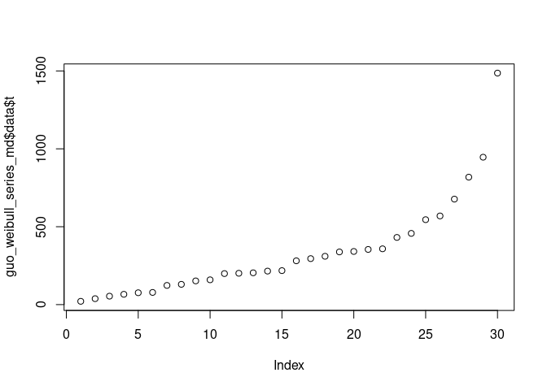

<!-- README.md is generated from README.Rmd. Please edit that file -->

# wei.series.md.c1.c2.c3

<!-- badges: start -->

<!-- badges: end -->

The goal of wei.series.md.c1.c2.c3 is to …

## Installation

You can install the development version of wei.series.md.c1.c2.c3 from
[GitHub](https://github.com/) with:

``` r
# install.packages("devtools")
devtools::install_github("queelius/wei.series.md.c1.c2.c3")
```

``` r
library(algebraic.dist)
#> Registered S3 method overwritten by 'algebraic.dist':
#>   method     from 
#>   print.dist stats
library(algebraic.mle)
library(wei.series.md.c1.c2.c3)
```

``` r
# fit the model
fit <- mle_numerical(mle_lbfgsb_wei_series_md_c1_c2_c3(
  df = guo_weibull_series_md$data,
  theta0 = c(1,1,1,1,1,1),
  control = list(
    maxit = 1000L,
    parscale = c(1, 1000, 1, 1000, 1, 1000))))

cbind(confint(fit),
  mle = params(fit),
  true = guo_weibull_series_md$mle)
#>               2.5%       97.5%        mle     true
#> param1   0.5736164    1.941626   1.257621   1.2576
#> param2 352.9027030 1635.838014 994.370358 994.3661
#> param3   0.5633925    1.763536   1.163464   1.1635
#> param4 310.1187793 1507.798853 908.958816 908.9458
#> param5   0.6054160    1.656147   1.130782   1.1308
#> param6 322.5652746 1357.623486 840.094380 840.1141

guo_weibull_series_md$loglike
#> [1] -228.6851
loglik_val(fit)
#> [1] -228.6851
```

We see that they are approximately the same.

``` r
# plot the data
plot(guo_weibull_series_md$data)
```


